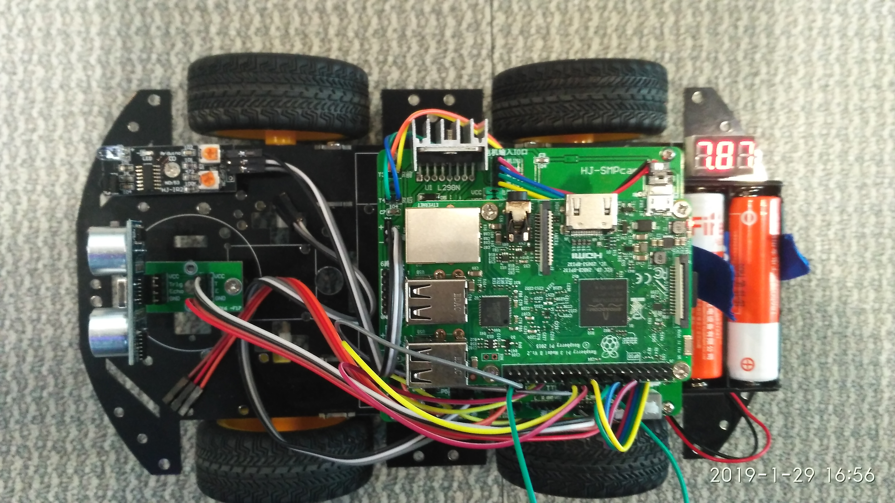
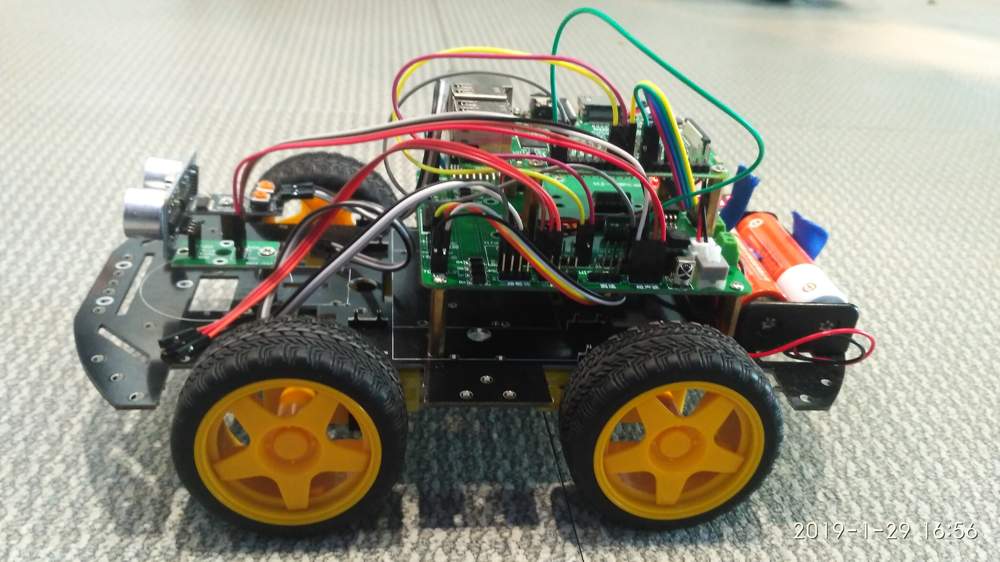
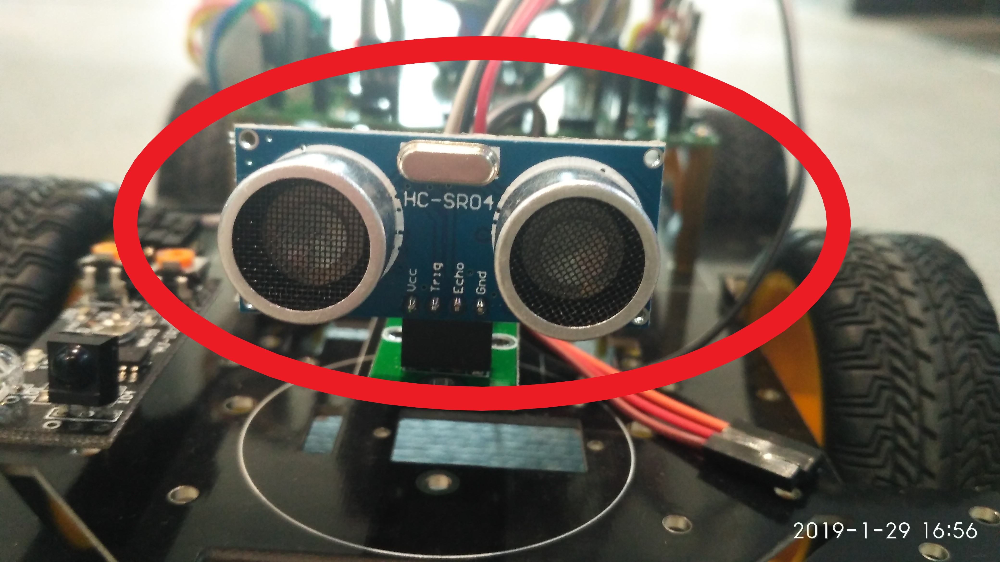
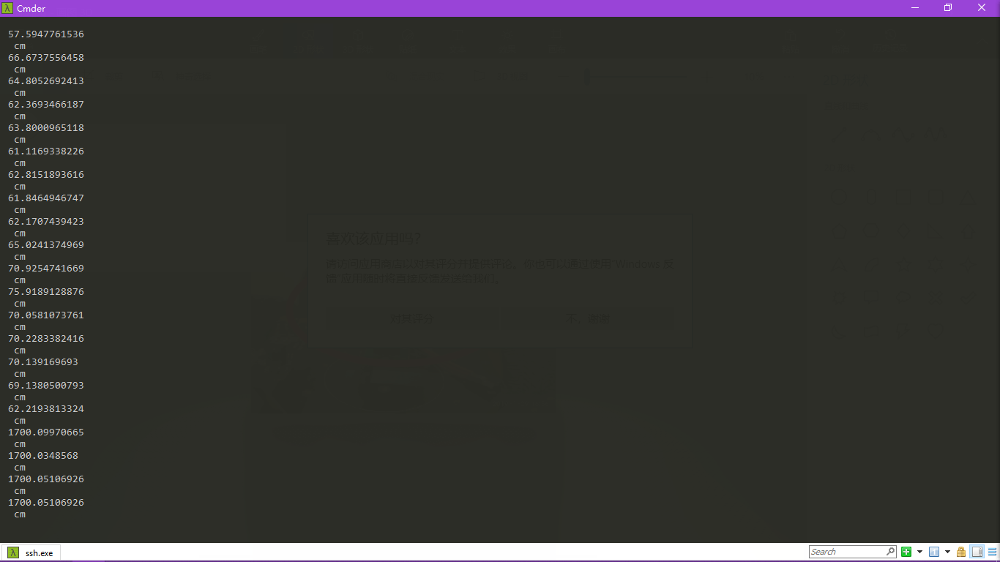

## Readme.md

### Non-Controller Car

无人驾驶车项目（说是车但是肯定不是那种大汽车啦，是下图这种车= _ =)





然而，我们今天做的只是要让它获得距离的值，并且在特定的距离停下来。

获取距离的方式：

```python
import wiringpi
import time
def dis():
    wiringpi.digitalWrite(28,0)
    t1=time.time()  
    time.sleep(0.00015)
    wiringpi.digitalWrite(28,1)
    while not wiringpi.digitalRead(29):
        t_n=time.time()
        if (t_n - t1)>=0.1:
            break
    while wiringpi.digitalRead(29):
        t_n=time.time()
        if (t_n - t1)>=0.1:
            break
    t2=time.time()
    s=(t2-t1)*34000/2
    print (s)
    print(" cm")
    return s
wiringpi.wiringPiSetup()
wiringpi.pinMode(28,1)
wiringpi.pinMode(29,0)
while 1:
    print(s)
    time.sleep(0.15)
```

此处利用了``超声波``测距，就是标了红圈的这个玩意



运行以后的结果就是这样的



**（输出的都是距离）**

然后在一个main文件导入我们的distance.py和acc.py，然后在直接运行main.py文件

那么distance.py就要去掉死循环，变成了

```python
import wiringpi
import time
def dis():
    wiringpi.digitalWrite(28,0)
    t1=time.time()  
    time.sleep(0.00015)
    wiringpi.digitalWrite(28,1)
    while not wiringpi.digitalRead(29):
        t_n=time.time()
        if (t_n - t1)>=0.1:
            break
    while wiringpi.digitalRead(29):
        t_n=time.time()
        if (t_n - t1)>=0.1:
            break
    t2=time.time()
    s=(t2-t1)*34000/2
    print (s)
    print(" cm")
    return s
wiringpi.wiringPiSetup()
wiringpi.pinMode(28,1)
wiringpi.pinMode(29,0)
```

然后用main.py结合一手

```python
import distance
import time
import acc as mv
s=0.0
while 1:
    s=distance.dis()
    if s<=80 and s>50:
        mv.forward(50)
    elif s<=50 and s>30:
        mv.forward(30)
    elif s<=30:
        mv.forward(0)
        break
    elif s>80:
        mv.forward(100)
    time.sleep(0.2)
```

就可以进行移动啦！